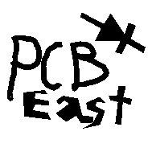
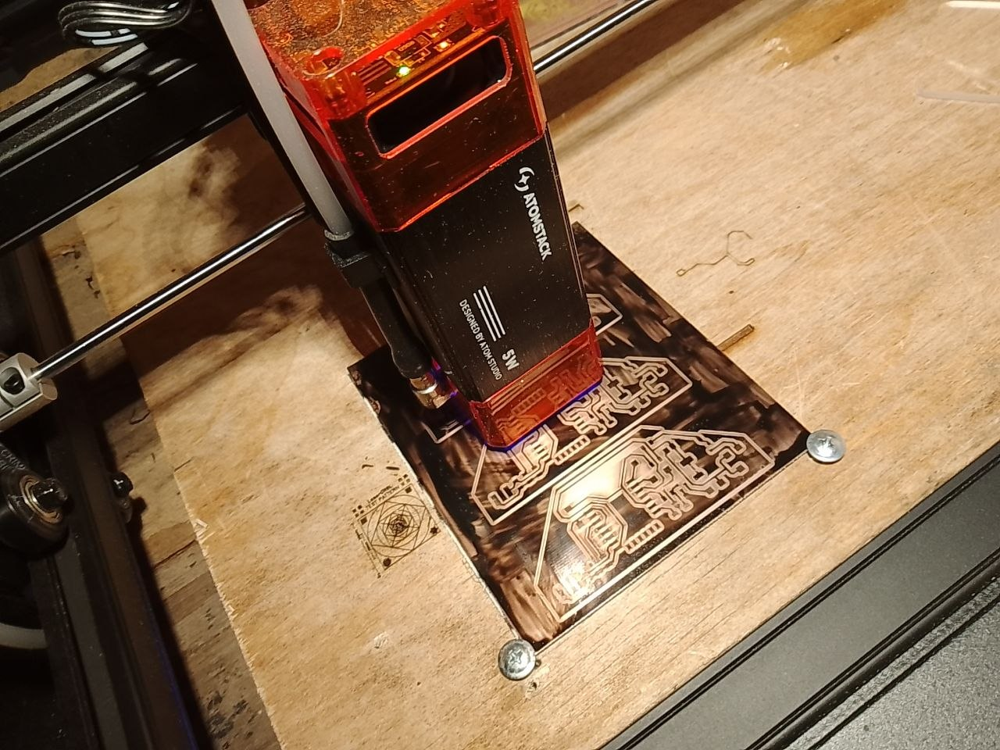
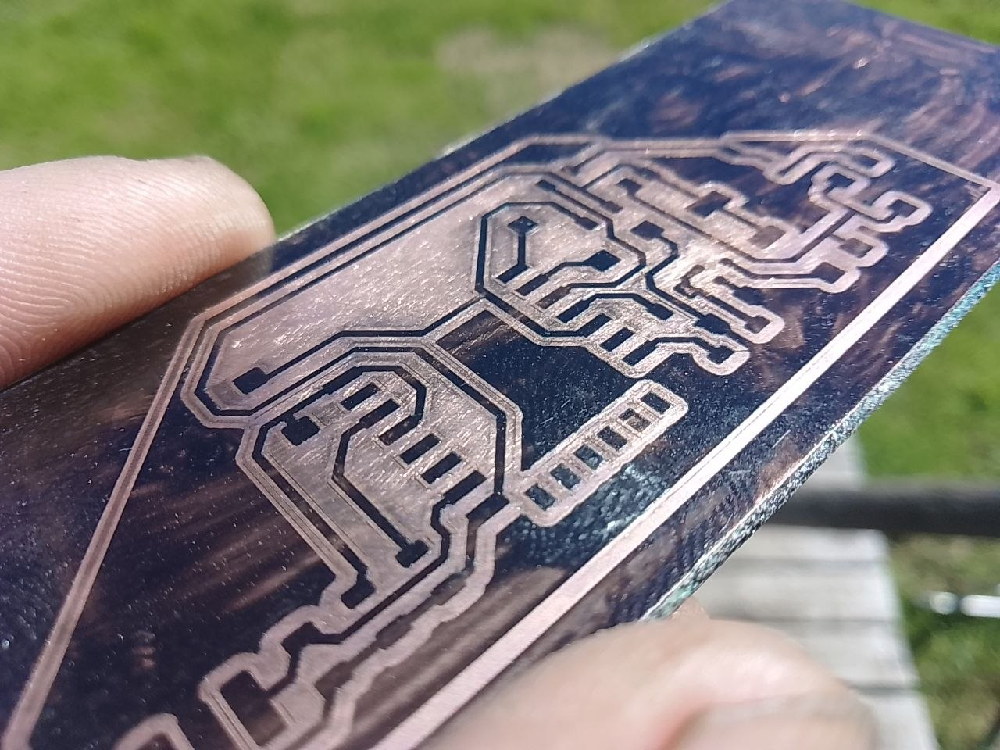
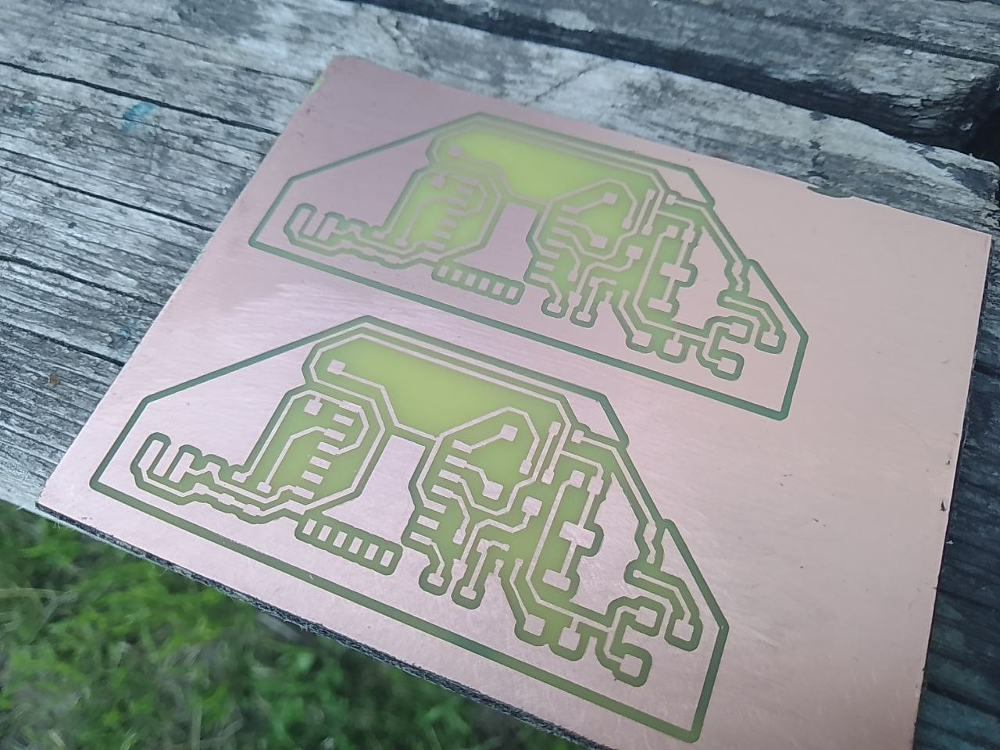

# pcbeast.sh

Набор скриптов, предназначенных для лазерного прожига масок печатных плат. Исходником служит .svg со штрихами, который обычно создает kicad. Писибист не является каким-то профессиональным инструментом и был получен на коленке под имевшуюся задачу, требовавшую срочного решения. Код написан на 99% методом вайбкодинга при помощи роботессы Google Gemini, тщательной проверке и оптимизации он пока не подвергался и в некоторых местах работает очень криво и медленно.

Началось с того, что мне нужно было изготовить партию простеньких печатных плат. Продукт, для которого они предназначались, находился на стадии постоянно меняющегося прототипа, платы требовались прямо сейчас сразу, в них могли внезапно возникнуть изменения. Поэтому заказ сотни-другой готовых ПП в Китае не выглядел целесообразным. В то же время старый-добрый ЛУТ несет высокие трудозатраты, отнимает массу времени, не гарантирует получения результата, и полностью состоит из ручного труда, требуещего остро отточенного навыка и большого опыта. В этот момент я и задумался о том - "а как же люди делают платы на лазерах?"

Да, для того существуют различные инструменты, но лично мне они показались очень замудренными. К тому же я много работаю на 3д принтере, мне привычен слайсер с его настройками - количество контуров, форма заполнения, итд. Еще мне хотелось что-то простенькое, что принимало бы формат svg. Рисунок печатной платы экспортируется в SVG (помимо всяких Взрослых форматов) из KiCad, которым я пользуюсь. SVG легко открывается и правится в любой векторной графической программе, его легко импортировать куда угодно для дальнейшей работы. Далее в технологической цепочке идет слайсер. На мой взгляд, это довольно удобно для работы с лазером, так как позволяет делать программы с довольно замысловатыми траекториями инструмента, а так же обеспечивает многопроходность, если делать модель на несколько слоев. 

Для слайсинга используется Prusa Slicer, профиль для него сохранен в ./confs/pcb-prusa-2pass.ini Вы можете сами создавать какие угодно профили в Prusa Slicer и использовать их. В дальнейшем, на этапе конвертации из гкода будет убрано все то, что не касается лазера, в том числе подача. Гкод будет преобразован так, что в нем будет использоваться 2 скорости подачи: для холостого хода и рабочего. Так же на рабочих зодах будет включаться лазер на заданную мощность.

После слайсера полученный гкод остается только конвертировать для FluidNC - и тогда маску можно жечь на плате!

Сперва я проделывал вышеописанные операции вручную, но затем появились отдельные скрипты, которые в итоге объеденились общей оболочкой, pcbeast.sh.

Для работы требуется Inkscape, OrcaSlicer (flatpak), Openscad. Сейчас это все захордкожено, потом будет настраиваемо. См в коде.

Скрипты совершенно самостоятельны. Однако, по пути обработки исходного файла их нужно выполнять в строгом порядке:
1. svg-offset.sh - Принимает исходный свг со штрихами и величину припуска. Работает с inkscape. В каталоге с исходным файлом сохрянаят свг (<name>_poly_offset.svg) с объединенными полигонами внутри.
2. svg-isolator.sh - Принимает свг, который содержит только полигоны и ширину изолирующего контура. Создает вокруг проводников общий полигон, больший на ширину контура, затем делает выворотку. В каталоге с исходным файлом сохрянаят свг (<name>_isolated.svg).
3. svgtostl.sh - Принимает свг и высоту, делает из него стл при помощи freescad, сохраняет в каталоге с исходником.
4. stltogcode.sh - Принимает исходный стл и профиль прюша. Делает гкод при помощи prusa slicer и сохраняет его в каталоге с исходником.
5. prntocnc.sh - Принимает исходный файл с гкодом для принтера, скорость подачи и мощность лазера. Конвертирует принтерный гкод в гкод для FluidNC, сохраняет результат (<name>_laser.gcode) в каталоге с исходником.

Заметки по технологии

1. Покраска текстолита. Красить можно чем угодно, что после отверждения легко смывается доступным вам растворителем. Лично я использую нитроцеллюлозный лак (лак для ногтей). Подойдут любые нитро- либо акриловые краски темных цветов. Вероятно, аэрозольный вариант будет удобнее всего. Матовать медный слой перед покраской не стоит.

2. Прожиг. Замечено, что двухпроходный прожиг (1 обычный слой + ironing, смотри ./confs/pcb-prusa-2pass.ini), хоть и занимает больше времени, но зато гарантирует отсутствие любых остатков несожженной краски. Важно не переборщить с мощностью лазера, так как 5Вт лазер способен перегреть фольгу вплоть до пузырения и порчи материала. Ищите баланс между подачей и мощностью. Лично я работаю на F5000 и S500. Не жалейте воздуха в процессе. Обратите внимание на то, что в реальности дорожки получаются не совсем такими, как нам хочется. Поэтому имеет смысл поиграть параметром припуска при обработке svg в svg-offset.sh.

3. Травление. Прожженный материал можно сразу класть в кювету с рабочим агентом. Однако, вы сразу заметите, что на прожженных участках осталась прилипшая сажа. Не переживайте - положите материал в кювету, покурите. Затем достаньте материал пинцетом и аккуратными круговыми движениями протрите его зубной щеткой. Это легко смоет налет, и далее травление пойдет быстро и равномерно. 